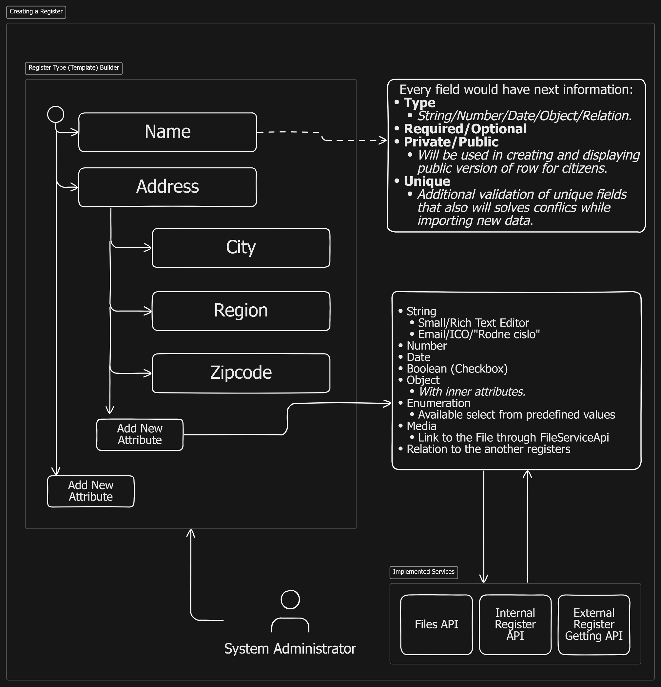
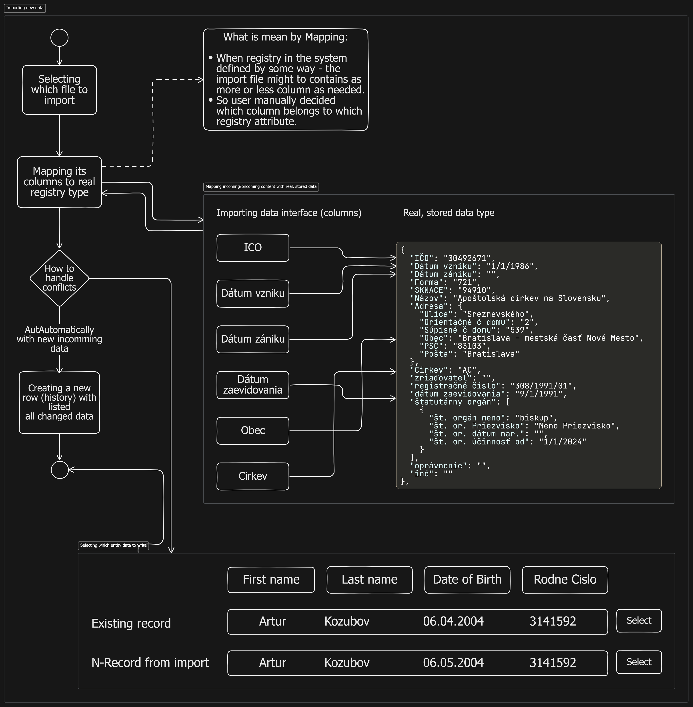

# Analyze

Our team has been tasked with developing a new Registry system for the Culture Subjects in Slovakia. The system will be used to store and manage information about museums, galleries, libraries, archives, and other cultural institutions in the country. The system will be used by government officials, cultural organizations, and the general public to access information about cultural subjects, such as their location, opening hours, exhibitions, and collections. The system will also be used to track changes to the data over time and ensure the accuracy and integrity of the information in the registry. One of the main goals of the system is to improve the process of collecting, storing, and sharing information about cultural subjects in Slovakia. Based on the requirements of the project, we have identified several key problems that need to be addressed in the development of the system. These problems include data validation, data consistency, versioning, permissions and roles, accessibility, analytics, data security, and search functionality. In this document, we will outline these problems in more detail and propose solutions to address them. We will also provide an overview of the implementation of the system and discuss the functional requirements that need to be met in order to develop the system successfully. The goal of this document is to provide a clear understanding of the problems that need to be addressed in the development of the system and to propose solutions that will help us achieve our goals. 

# Defining the problems

## Data Validation

### Definition

Now there's problem with filling the table data. Even when coworker has a clear instruction to fill the table, there's still a possibility they might input incorrect data. For instance, they could enter data of the wrong type, input the wrong value (such as a negative number or a value outside the acceptable range), or leave a cell unfilled altogether.

> So, currently, there isn't a validation system or straightforward logic in place to ensure the accuracy of the inputted data.

### Solution

To address this issue, we can implement a data validation system that will check the inputted data against a set of predefined rules. If the data fails to meet these rules, the system will prompt the user to correct the error before proceeding. This will help ensure the accuracy and integrity of the data in the table.

### Implementation

## Data Consistency

### Definition

When having table with already filled data, there's might be several conflicts while importing "new" data. For instance, the new data might contain duplicate entries, conflicting information, or data that is inconsistent with the existing data in the table.

> So, currently, there isn't a system in place to handle these conflicts and ensure the consistency of the data in the table.

### Solution

For solving this problem we might to implement a GUI interface with two posibilities:
1. **Merge**: Coworker by himself can choose which data to keep and which to discard.
2. **Auto Overwrite**: System will automatically overwrite the conflicting data with the new, incomming data.

_To calculate which data would have conflicts - use existing metadata about registry type - and get its unique columns._

>Every time there is change on record - system will write and store all changes and link to existing record. _More about [versioning](#versioning) in the next section._

### Implementation

## Versioning

### Definition

There's requirements to store all changes in the registry. This means that we need to keep track of all changes made to the data in the table, including who made the change, when it was made, and what the change was.

> Currently, there isn't a system in place to track and store all changes made to the data in the table.

### Solution

To address issues with data loss and state of a subject at some time moment we propose to use gybrid system with snapshots and transactions. There would be a instance with real data ("exsisting at now") that will have several relations on history of changes ("transactions") and published versions ("snaphosts"). Published version is for public access and transactions are for tracking internal use and changing.

Storing all changes gives:
- _Data consistency_: We can always go back to the previous state of the registry and also we know how who and when changed the registry.  
- _Data versioning_ - Whatever happens to the system as a whole there are still many versions of the registry that can be easily transferred to another system because of size.

>Publishing a version of the registrty entry might be implemented through different wats:
>- _After some period of time_
>- _On demand_: On every change to the actual registry entry - publish the a new one.

### Implementation

You can choose any implementation.

<!-- TODO Miwa опиши -->

## Permissions & Roles

### Definition

<!-- TODO: Ilya maybe you can write something here -->

<!-- The system must have a role-based access control system that allows administrators to assign specific permissions to users based on their role. This will help ensure that users only have access to the data and features that are relevant to their role, and prevent unauthorized access to sensitive information. -->

### Definition (Permisions)

Permissions are the rules that determine what actions a user can perform within the some system's part. For example: read, write registry data from specific registry. In other words, permissions are the rules that determine a small part of the system's functionality that a user can access. 

### Definition (Roles)

Roles are the sets of permissions that are assigned to a user based on their role within the organization. For example, an administrator might have full access to all features and data in the system, while a regular user might only have access to view and edit their own data. Roles help define the level of access that a user has within the system and ensure that users only have access to the data and features that are relevant to their role.

### Solution

The system will have a role-based access control system that allows administrators to create new accounts and assign specific roles to users. Each role will have a set of permissions that define what actions the user can perform within the system. This will help ensure that users only have access to the data and features that are relevant to their role, and prevent unauthorized access to sensitive information.

## Accessibility

### Definition

The system must offer a logical and user-friendly interface that is comprehensible and usable by all users. It should be accessible from any device, compliant with current legislation and accessibility guidelines, and built using certified technologies with long-term support.

### Solution

The system will be accessible through a web interface designed in accordance with the Unified Design Manual for Electronic Services and Websites ([ID-SK Frontend](https://idsk.gov.sk)). This component is built using the latest accessible technologies and guidelines outlined in the manual, which aims to standardize user interfaces and communication methods for electronic services in Slovakia. Therefore, this will be a cost-effective and reliable solution that meets all accessibility requirements.

## Analytics

### Definition

At the now moment there's any tools for analyzing the data in the table. This means that users cannot easily generate reports, visualize data, or gain insights from the data in the table.

>Analyzing museum and cultural data can help governments optimize revenue, improve operational efficiency, attract cultural tourists, foster public-private partnerships, and inform long-term planning, ultimately leading to financial benefits and economic growth.

### Solution

Creating

## Data Security

### Definition

The system must have a robust security system that protects the data from unauthorized access, modification, or deletion. It should use encryption to secure data in transit and at rest, implement access controls to restrict user access to sensitive information, and have a backup and recovery system in place to prevent data loss.

### Solution

The system will use encryption to secure data in transit and at rest, implement access controls to restrict user access to sensitive information, and have a backup and recovery system in place to prevent data loss. This will help ensure the security and integrity of the data in the system and protect it from unauthorized access, modification, or deletion.

## Search

### Definition

The system must have a search functionality that allows users to quickly and easily find the information about or in the Registry. The search functionality should be fast, accourate, and user-friendly, and allow users to search by various criteria, such as name, ID, date, or other metadata.

### Solution

The system will have a search functionality that to quickly and easily find the information by various criteria. This will help users to quickly find the information they need and improve the overall usability of the system.

<!-- Functional requirements (хуйня, которая должна там быть) -->

# Implementation

# Architecture and Technologies
We will use Domain Driven Design architecture in our project what makes Business Logic abstracted away from the Technological Layer.In practice this mean that we are not bounded with any technology - neither data (XML, JSON, NO-SQL, Relation DB) Layer, nor the Transport Layer (TCP, REST, gRPC, SOAP). 
We prefer NO-SQL and REST as data and transport layers but this is discussable point.

We need to balance complexity, security and availability. That's why we want to use best solution right now - Docker. It will provide enough level of protection and portability. 

### Components
- database
- api server
- business analytics
- client host

With Docker app will be easily deployable as Kubernetes cluster.