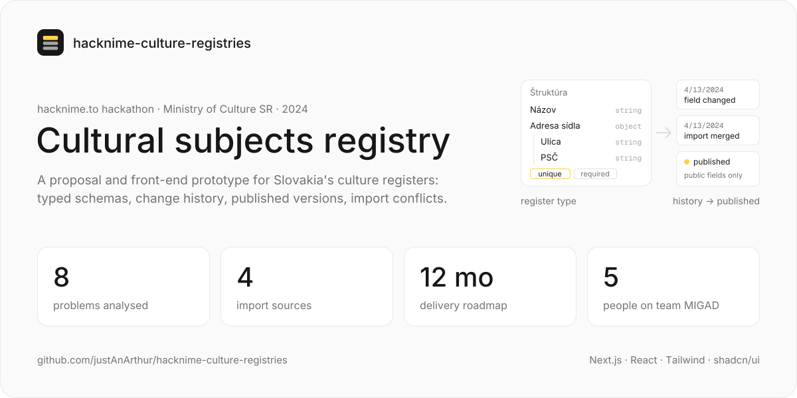
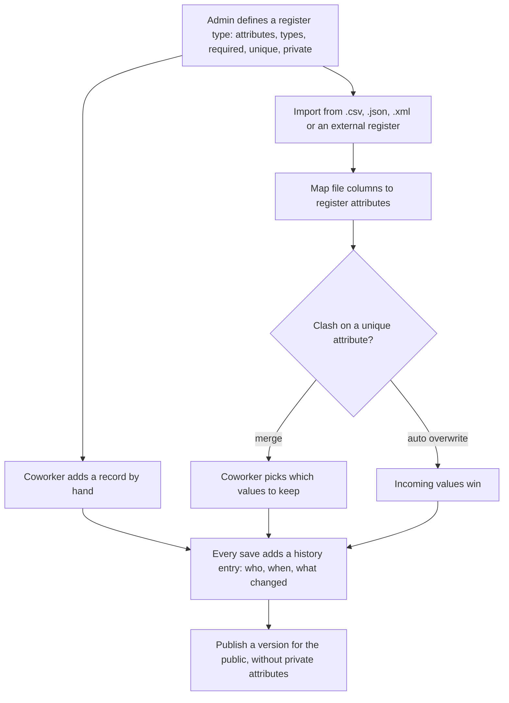

<a href="https://github.com/justAnArthur/hacknime-culture-registries"></a>

# Cultural subjects registry

A proposal and front-end prototype for a registry of cultural subjects in Slovakia: museums, galleries, libraries,
archives and other cultural institutions. Built by team MIGAD at the [hacknime.to](https://www.hacknime.to) hackathon
in April 2024, on the Ministry of Culture of the Slovak Republic's brief *Registre kultúrnych subjektov*.

> Finished and archived. The prototype runs on sample data in the browser; there is no backend.

## What it does

- Analyses eight problems with the current registers (data validation, consistency on import, versioning, permissions
  and roles, accessibility, analytics, data security, search) and proposes a solution for each
- Register types: every attribute has a type, required or optional, private or public, unique, and a hint; object
  attributes nest further attributes. The prototype's sample register is TV broadcasters (*Televízni vysielatelia*)
- Import from .csv, .json, .xml or an external register: map the file's columns to register attributes, then resolve
  clashes on unique attributes by merging by hand or overwriting automatically
- Versioning as a hybrid of transactions and snapshots: every save records who changed what and when, and published
  versions are the public copy for citizens, without private attributes
- Proposes role-based access, a UI following the Slovak government design manual ([ID-SK](https://idsk.gov.sk)), an
  analytics module and a 12-month delivery roadmap
- Prototype screens: the register table with its structure tree, published versions and change history; a new-record
  form generated from the register type with a panel for possible conflicts; the import and add-attribute dialogs

## How it works



The proposed architecture uses domain-driven design to keep business logic apart from storage and transport. The team
preferred NoSQL and REST, with the database, API server, business analytics and client host in Docker, deployable as a
Kubernetes cluster.

## Run

The prototype only:

```bash
cd prototype
yarn install
yarn dev    # http://localhost:3000, redirects to /registry/televizni_vysielatelia
```

## Stack

Prototype: Next.js 14, React 18, Tailwind CSS 3, shadcn/ui on Radix UI, next-pwa. Analysis in Markdown with Mermaid
sketches; pitch deck as a PDF.

## Team

MIGAD: Heorhi Davydau, Artur Kozubov, Illia Chaban, Mykhailo Sichkaruk, Dmytro Dzhuha.

## Documentation

- [MIGAD Presentation.pdf](MIGAD%20Presentation.pdf): the 12-slide pitch (Slovak)
- [.md](.md): problem analysis and proposed solutions
- [project.md](project.md): problems, main processes, server architecture and data model sketches
- [processes/.md](processes/.md): main processes and attribute types
- [processes/roadmap.md](processes/roadmap.md): 12-month delivery plan
- [discussion.md](discussion.md), [low-priority.md](low-priority.md): open questions
- [image.png](image.png): register type builder; [image-1.png](image-1.png): import and conflict flow
- [prototype/](prototype): the Next.js prototype
