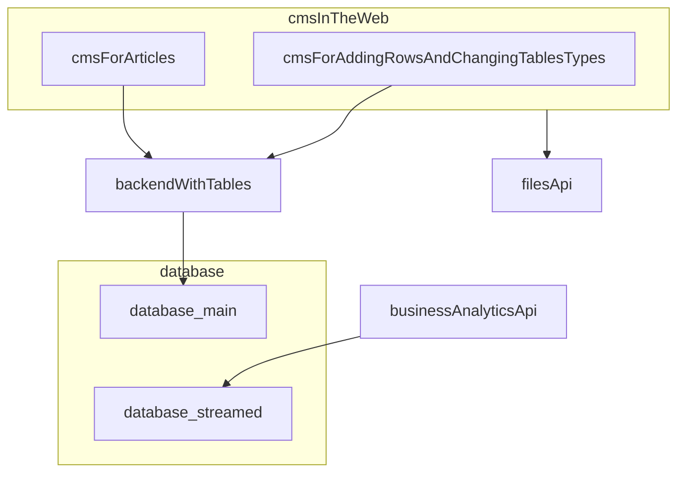

Application solves problems

# Problems

- Validation data in tables
  - Required/Optional - Types
  - _Public/Private_
- Relations between tables
- Versioning
  - Storing every changes that was made. And by who.
  - Separete entitties for public.
- Security
  - Roles and permissions.
- Asking citizens for required data. (Like in google forms)
  - Send (on public) form to ciziens and on submit - make status in database like REQUSTED_.

# Requirements

- Security.
- Cheap.
- Easy to migrate.

# Main processes

- CRUD register (table) with column types, required/optional, 
  public/private, unique, relations.
- Filling and creating new row in register. With displaying versioning
  changes. and public versions.
    - Show and "deleted" rows.
    - Publish to web with date range.
- Creating and managing roles and permissions. 
- Export import data from .xls, .xml, .csv.
- Publish to web with date range.
- Aprove/Validation changes in register.
---
- analyze difference between two versions of register.


# Server architecture




# Database architecture

```mermaid

```

# Entities

Enum `Roles`: 
- Admin
- manager  

`User`:
> attributes:
- name
- email
- password
- role
`Register` 
> attributes:
  - name
  - law
  - shema
  - data 
> methods:
- create
- release
- import data
- export data

`Schema` 
attributes:
- name
- Map<"Property": "Value"> 

`Property`:
- name
- type
- validatio schema
- is unique
- is required
- is public
- is indintyfiei

`RegisterRelease`:
> attributes:
- register
> methods:
- publish
- sign
- 